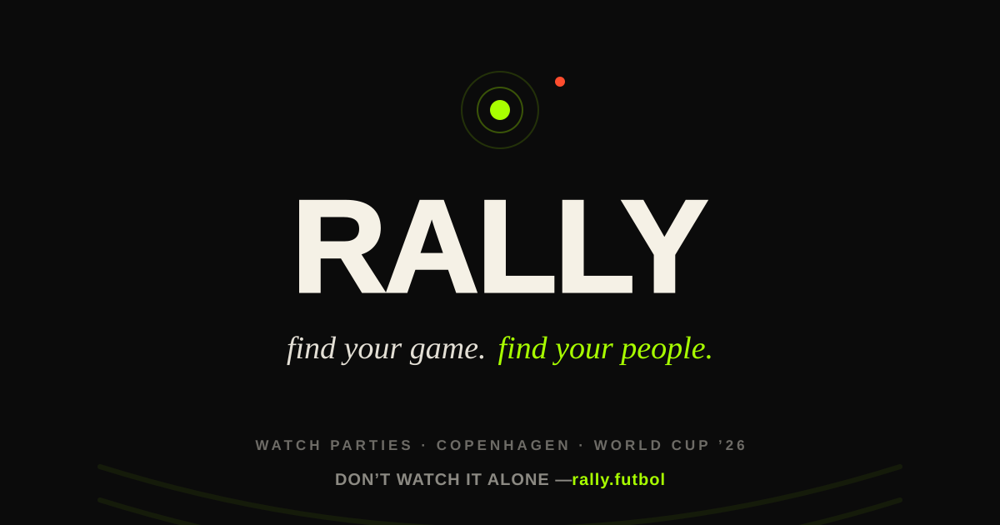
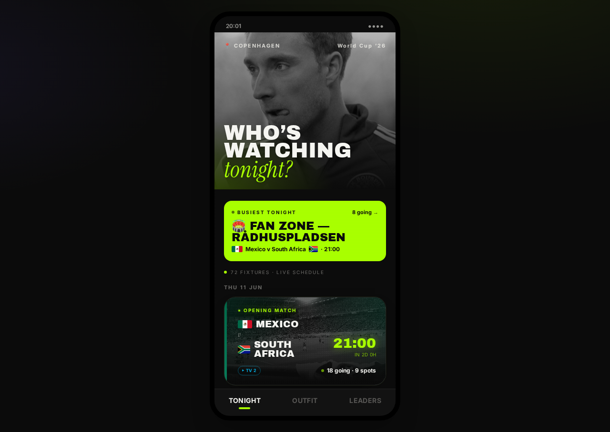
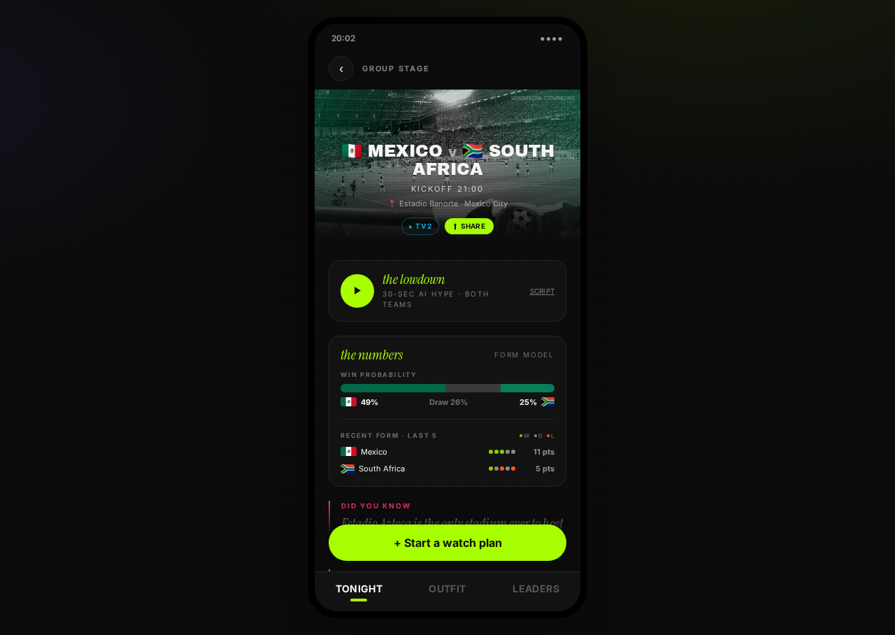
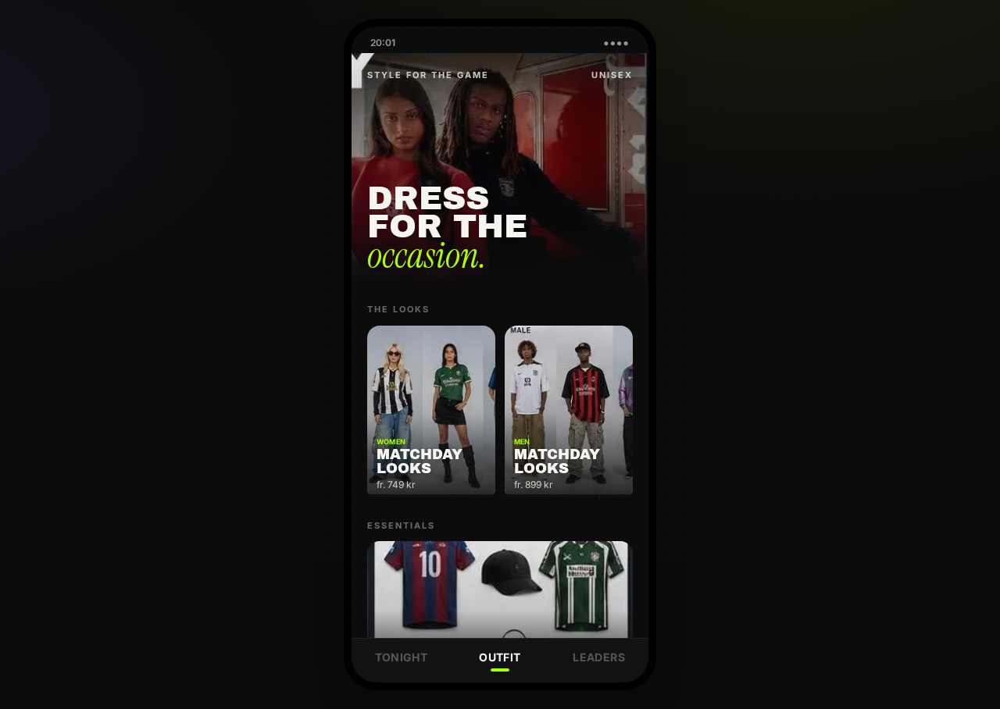
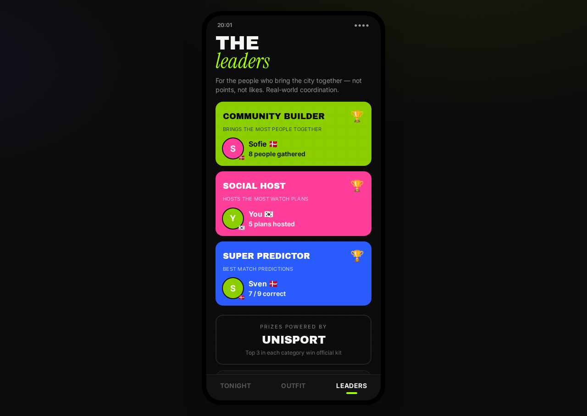

<div align="center">



# RALLY

### Find your game. Find your people.

**The best seat isn't the stadium — it's a packed bar in Copenhagen with your lot.**

RALLY finds where tonight's match is on, who's already there, and saves you a seat.
*We don't just watch the game. We rally for it.*

[**▶ Live — rally.futbol**](https://www.rally.futbol) &nbsp;·&nbsp; [The voice](./SOUL.md) &nbsp;·&nbsp; [Architecture](./CLAUDE.md) &nbsp;·&nbsp; [Roadmap](./docs/RALLY-10x-plan.md)

`React + Vite + Tailwind` &nbsp; `Supabase` &nbsp; `mobile-first` &nbsp; `72 real WC2026 fixtures`

</div>

---

## Have a look

<table>
  <tr>
    <td align="center" width="50%">
      <br/>
      <sub><b>Tonight</b> — who's watching, where, how many</sub>
    </td>
    <td align="center" width="50%">
      <br/>
      <sub><b>The lowdown</b> + the numbers, every match</sub>
    </td>
  </tr>
  <tr>
    <td align="center" width="50%">
      <br/>
      <sub><b>Outfit</b> — dress for the occasion</sub>
    </td>
    <td align="center" width="50%">
      <br/>
      <sub><b>Leaders</b> — the people who bring the city together</sub>
    </td>
  </tr>
</table>

---

## The pitch, in 60 seconds

Every other football app is plumbing — fixtures, a stat, a TV channel, no opinion. RALLY is the mate in your group chat who's seen every match, loves you, and will absolutely roast your team. It knows a Tuesday-night dead rubber between two sides going home is still somebody's everything, and it wants you off the sofa and into the room.

Open it on a match night and it tells you straight: **who's watching tonight, which bar, and how many are already in.** Tap a fixture for the lowdown — 30 seconds of cocky love for both teams — then the win-probability, the form, the head-to-head, the squads, the all-time record. Pick a spot, bring your people, and the "going" count ticks up live on every phone. Don't be the one who watched it alone. Skål.

## What's real (this isn't a mockup)

It's **live on a real Supabase backend** — schema, row-level security, Realtime, and Edge Functions on cron. The whole loop works end to end.

- **Tonight** — the full 72-match World Cup '26 group stage with Copenhagen kickoff times, a **"busiest tonight"** banner so you know where the night is, and live-aware cards: a ticking countdown → **● LIVE 67' · 2–1** → **FULL TIME**.
- **Live scores** — a Supabase Edge Function reads a free public feed every minute (guarded to match windows) and pushes to every phone over Realtime. No key, no quota.
- **Persistent, shared plans** — anonymous auth, real Postgres rows, "going" counts that update across devices the moment someone else taps in.
- **The numbers** — win-probability + recent form on **every** match. A real model when it's populated, a form-based estimate otherwise. Never blank, never a "bet now" — predictions are banter and a hook, full stop.
- **Teams** — full squad lists for all 48 nations + all-time World Cup records, straight from the backend.
- **Match art** — national colours and flags, or for fixtures with history a real **B&W Creative-Commons photo** of the two teams (properly attributed). Never a stock photo.
- **Share** — a generated matchday **poster** plus per-plan link unfurls that name the game, the bar, and the headcount — all written in RALLY's voice.
- **Goal alerts** — web push for the installed PWA (Add to Home Screen). A native iPhone app via Capacitor is on the way.
- **Outfit + Leaders** — dress for the occasion (shop via Miinto), and a leaderboard for the people who actually pull the city together — most plans hosted, most people gathered, best predictions.

Swap the data source and the UI never flinches: live, the shape comes from Supabase over Realtime; the double-click `RALLY — open me.html` runs the exact same app from `file://` in a self-contained demo mode with no backend.

## The voice is the moat

Anyone can ship a fixtures list by Friday. Nobody can ship *this mate* — the specific, opinionated, warm, football-soaked voice that makes a 0–0 between two eliminated teams feel like the only place to be. Every lowdown, push, share card, button and empty state is written by the same character. Read [`SOUL.md`](./SOUL.md) — it's the source of truth, guarded like the brand depends on it, because it does.

## Under the hood

Live on Supabase: schema, RLS, Realtime. Tables: `matches`, `venues`, `plans`, `plan_participants`, `profiles`, `predictions`, `squads`, `team_records`, `push_subscriptions`. Scheduled work runs as Supabase **Edge Functions** on `pg_cron`:

| Function | Schedule | Does |
|---|---|---|
| `live-scores` | every minute (match-window guarded) | pulls live scores from a free public feed → `matches` |
| `sync-fixtures` | daily | refreshes the schedule |
| `sync-squads` | daily | refreshes squad lists |

Per-plan share unfurls run on the edge: a middleware routes link-preview crawlers on `/p/<id>` to a serverless OG renderer that names the match in voice, with a generated landscape poster as the image. The seed/build scripts in `source/scripts/` normalise external sources into the one shape the UI reads.

## Run it

```bash
cd source
npm install
npm run dev               # local dev server (phone frame on desktop)
npm run build             # chunked web build → dist/ (what Vercel serves)
npm run build:standalone  # single inlined file → dist/index.html (file:// demo)
```

After `npm run build:standalone`, copy `dist/index.html` to `../RALLY — open me.html` to refresh the no-server standalone.

## A few calls we made

- **The voice over everything.** If a line could've come from a neutral fixtures app, it's wrong. See `SOUL.md`.
- **Live scores from a free public feed**, only during match windows, URL in a Supabase secret — never in the repo.
- **Anonymous auth first** so anyone can join and create a plan with zero friction.
- **Channels matched by team pair, not time** — two teams meet once in the group stage, so the pair is a stable key that self-heals if a match moves.
- **Commercial licences only** for archive photos (CC BY / BY-SA / CC0 / PD — never NC/ND), attribution stored per image and rendered in-app.
- **Mobile-first & fast** — 48 flags bundled as data URIs (zero flag requests), images shipped as WebP, the heavy screens code-split so first paint is instant. Mobile Lighthouse 90+.
- **Two builds, one codebase** — chunked for the web, single-file for the standalone, same UI.

## Tech

React 18 · Vite 5 · Tailwind 3 · `vite-plugin-singlefile` (standalone) · **Supabase** (Postgres + RLS + Realtime + Edge Functions + `pg_cron`) · `@vercel/og` posters · `@vercel/edge` middleware + serverless `p-og` for share unfurls · `web-push` for goal alerts · `@capacitor/ios` for the native wrap. Front-end on Vercel (`rally`, www.rally.futbol); backend on Supabase.

## Not affiliated

Not affiliated with FIFA. No FIFA or "World Cup" marks are used in the brand. Danish TV channels are real where matched, illustrative otherwise. Commons images keep their attribution (`docs/ATTRIBUTION.md`).

---

<div align="center">

*We don't just watch the game. We rally for it.*

</div>
