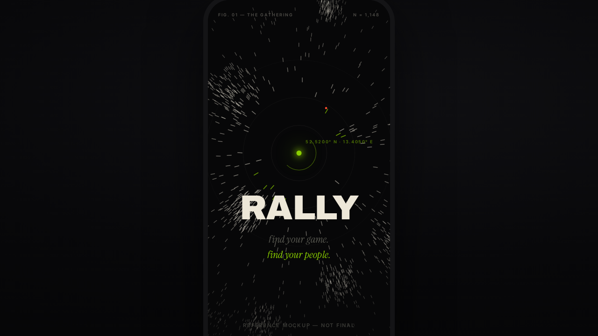
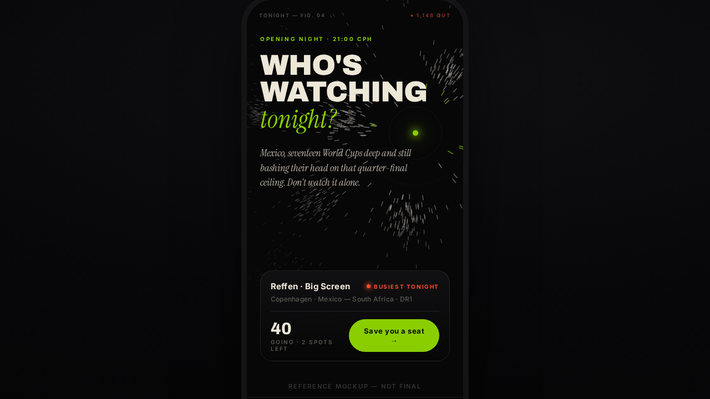

# RALLY — Rebrand Suggestion: **Convergence**

*A proposal, not a redesign. One evolved direction for the team to react to.*
Nothing here is built into the app — App.jsx / theme.js are untouched. The two
images below are **reference mockups, not final.**

Source of truth: `RALLY-design-philosophy.md` (Convergence — the visual soul),
`SOUL.md` (the voice), `SKILL.md` (the brand we keep faith with), and the
just-shipped "Floodlight" theme (`source/src/theme.js`).

---

## 1. The thesis

RALLY's entire reason to exist is the **gathering** — "find your people," get off
the sofa, into the room. Convergence is that exact idea drawn as an image: *many
scattered marks, each small and autonomous, leaning as one body toward a single
point of attention — and in that quiet alignment a crowd is born.* The product
metaphor and the visual metaphor are the same thing. A generic neon sports look
says "fixtures app with the lights turned up." A field of marks resolving on one
lime node says **find your people** before a single word is read. That's the
brand earning its tagline in pure pattern — and it's the one thing a competitor
can't clone overnight, the same way they can't clone the SOUL voice. The poster
*is* the promise: separateness resolves, attention gathers, many become one.

---

## 2. What stays / what evolves

Honest accounting against today's brand (`SKILL.md` + the live Floodlight theme).

| Element | Today | Proposal | Verdict |
|---|---|---|---|
| Ink base | Deep ink `#0B0B0B`, ambient gradients | **Charged near-black** `#070708` — darker, held in disciplined reserve | **Keep, deepen** |
| Hero colour | Lime `#8ACE00` (classic) / `#A8FF00` (Floodlight neon) | Lime **`#8ACE00`** as the one *living hue* — rationed, not glowing everywhere | **Keep lime, ration it** |
| Headline type | Archivo Black, loud | Archivo Black — but used *rarely*, one monumental word | **Keep, restrain** |
| Italic accent | Instrument Serif italic | Same — the "whisper" that names the feeling | **Keep** |
| Body / labels | Inter, uppercase tracked | Inter — now also the *clinical margin labels & coordinates* | **Keep, extend** |
| Multi-accent neon | Lime + pink + cyan + violet, team spines, halftone | **One rarer accent only** (ember `#FF4D2E`) for the singular event | **Evolve — cut the rainbow** |
| Darkness | Ink + glow, fairly busy | Vast charged darkness; a few luminous marks carry the weight | **Evolve — more void** |
| Motif | Team-colour spines, halftone grain | **The converging crowd-field** + instrumentation rings | **New — the centrepiece** |

The one-line read: **keep the bones (ink, Archivo, the serif whisper, lime),
cut the neon clutter, and add the converging-crowd motif as the brand's signature
image.** Floodlight was the right instinct (drama on dark) — Convergence is the
disciplined version of it.

---

## 3. Concrete proposals

### Palette — keep lime, ration it

The strong recommendation is **keep `#8ACE00`** (don't shift). It's already the
brand mark in `SKILL.md`, it owns "RALLY" in people's heads, and against true
near-black it reads as *charge*, not decoration. The change isn't the hue — it's
the **discipline**: lime stops being a wash and becomes the rationed signal that
marks the focal node and the live moment. Pull back from the Floodlight neon
`#A8FF00` toward the calmer, more editorial `#8ACE00`.

| Token | Hex | Role |
|---|---|---|
| Ink (void) | `#070708` | The charged darkness. Primary ground. |
| Ink raised | `#0B0B0D` | Cards, panels. |
| Bone | `#EDE7D8` | Text, the marks at rest. (Warm, not white — faithful to "paper not pure white.") |
| **Lime (living hue)** | **`#8ACE00`** | The one charge: focal node, primary CTA, the live signal, one word in the whisper. |
| **Ember (rarer accent)** | **`#FF4D2E`** | *One* accent, used sparingly — the singular event: "● LIVE", "busiest tonight", the single ember mark. |
| Muted | `#5A5A52` | Margin labels, recede. |

**Retire from the hero system:** pink/cyan/violet as decorative accents and the
multi-colour team spines. (They can survive as functional data-encoding *inside*
the analytics panel if needed — but they leave the brand surface.) One accent per
surface was always the `SKILL.md` rule; Convergence just enforces it.

### Type roles — type as a rare gesture

Words exist only to confirm what the composition already knows.

- **The monument** — Archivo Black, one word, big (e.g. `RALLY`, `TONIGHT`,
  `WHO'S WATCHING`). Used once per screen, never stacked into paragraphs.
- **The whisper** — Instrument Serif italic, lowercase. Names the feeling:
  *find your people.* · *tonight?* This is the soft half of RALLY's signature
  rhythm (one heavy line, one soft line — `SOUL.md` rule 7).
- **The notation** — Inter 600, 9px, `letter-spacing:.22em`, uppercase. Clinical
  margin labels and coordinates: `FIG. 01 — THE GATHERING`, `N = 1,148`,
  `52.5200° N · 13.4050° E`. This is the "instrumentation" voice — it makes an
  ephemeral human impulse look mapped, studied, proven.

### The convergence motif (the centrepiece)

A field of short strokes ("marks"), each leaning toward a **focal node**. Marks
**thin at the edges, accumulate toward the core, and leave the node ringed in
stillness.** They cluster in organic knots (a crowd, not a sunburst). The node is
the one lime charge.

Applied across surfaces:

- **Splash / onboarding** — the full field resolving on the lime node, `RALLY`
  monument + italic whisper. *(mockup #1 below)*
- **Tonight hero** — the field frames the headline and resolves on the **venue**
  node; the "busiest tonight" venue literally is where the crowd converges.
  *(mockup #2 below)*
- **Matchday poster** (share/social) — same field, two-team kickoff as the
  monument, one ember accent for the marquee match. Shareable, screenshot-bait
  (`SOUL.md`: "if you'd screenshot it and send it to the group chat, ship it").
- **Loading / empty states** — marks *un-converged*, scattered and drifting; the
  empty state is literally "nobody's gathered yet." Copy stays SOUL:
  *"Nobody's called it yet tonight. Be the one who starts the rally."*
- **Wordmark / logo lockup** — `RALLY` with the focal-node dot replacing/seeding
  the mark (a lime node where the crowd resolves), italic tagline beneath. The
  existing app-icon lime square survives for stores; the node becomes the
  in-product signature.

### Motion — marks settling into alignment

The brand's one animation idea: **scattered marks drift, then settle into their
leaning alignment** as a screen loads — convergence happening in real time.
Kept quick and physical (`SKILL.md`). On the loop/nudge, a few fresh marks fly in
toward the node ("40 already in… two spots left. Move."). Convergence becomes the
loading state, the success state, and the live-headcount-ticking-up state — one
motion primitive, many uses.

### Instrumentation detail layer

Faint concentric **registration rings** around the focal node, one with a tick
arc; **clinical coordinate labels** pinned in the margins (Copenhagen's lat/long,
`N = ` headcount, `FIG. 0X`). This is the "made with such care the care becomes
the subject" layer — it gives a social app the authority of a scientific plate
and rewards leaning in close, without adding visual noise to the core.

---

## Reference mockups *(not final)*

**#1 — Splash: the gathering.** The field converges on one lime node; `RALLY`
monument; two-line italic whisper; registration rings + margin coordinates; a
single ember mark as the rarer accent.

**#2 — Tonight hero / matchday poster.** Signature rhythm in type
(**WHO'S WATCHING** *tonight?*), the crowd-field resolving on the **venue** node,
an instrument-styled fixture card, SOUL-voice copy ("Save you a seat", "Don't
watch it alone"), `● 1,148 OUT` in ember.

For contrast, today's live splash: `./rebrand-mockups/_current-site.png`.

---

## 4. Where it shows up first (pilot — suggest, don't build)

Three highest-leverage surfaces, in order:

1. **Splash / onboarding.** Highest brand-per-pixel, zero data dependencies, sets
   the tone in the first second. Lowest risk to pilot, biggest first impression.
2. **The Tonight hero band** (top of the match list). The most-seen screen in the
   app; the "busiest tonight" node *is* the convergence metaphor doing a real job.
3. **Share / matchday poster.** Convergence is built to be screenshot and
   forwarded — this is where the brand spreads outside the app and where the
   motif earns its keep on growth, not just polish.

Everything else (cards, detail screens, analytics) can keep the current system
and adopt Convergence gradually — the motif is additive, not a teardown.

---

## 5. Risks / open questions

- **Performance.** The field is hundreds of marks. On the splash it's a one-shot
  static render (cheap, can be a baked PNG/SVG). As live motion on the Tonight
  hero it needs care on low-end phones — pilot static first, animate only if it
  stays smooth. (Mobile perf is a stated priority in this repo.)
- **Legibility over the field.** Marks behind the hero must never fight the
  headline. The mockups keep the field thin where type sits — needs a real
  contrast/AA pass before any ship.
- **Losing the neon energy.** Floodlight just shipped and is loud-and-fun.
  Convergence trades some immediate pop for restraint and depth. Is the team
  ready to dial back the rainbow, or does the neon convert younger users better?
  Worth an A/B on the splash.
- **Lime, kept or shifted?** Proposal says **keep `#8ACE00`** and ration it. If
  the team wants more distance from "generic sports lime," the fallback is a
  slightly more acidic lime — but the recommendation is to change *discipline,
  not hue*.
- **Does "scientific plate" instrumentation read as cold?** It must stay in
  service of warmth (SOUL is a warm mate, not a lab). The clinical labels are
  seasoning — if they ever make the brand feel clinical, cut them before the lime.
- **Effort.** This is an evolution, not a one-afternoon theme flip. Scope the
  pilot to the 3 surfaces above before committing the whole app.

---

*Made with such care that the care itself becomes the subject. — `RALLY-design-philosophy.md`*
*We don't just watch the game. We rally for it. — `SOUL.md`*
