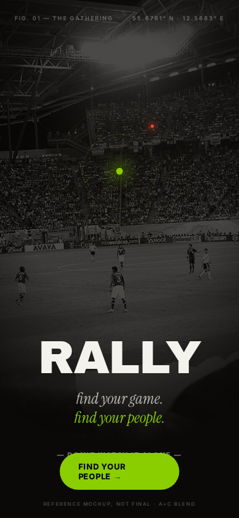
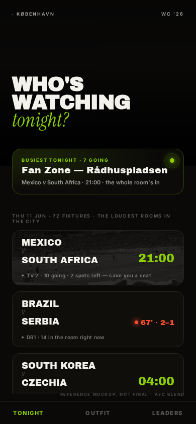
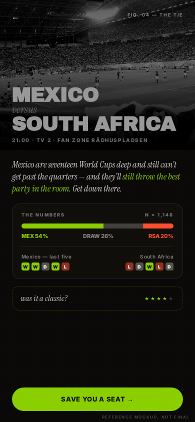
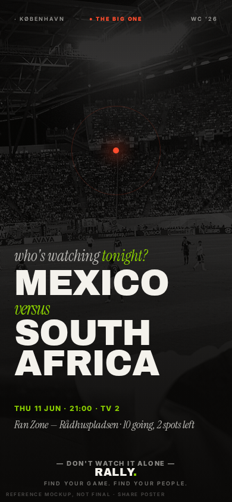

# RALLY — Rebrand Suggestion: **The room as hero** (A+C blend)

*A proposal, not a redesign. One evolved direction for the team to react to.*
Nothing here is built into the app — `App.jsx` / `theme.js` are untouched. Every
image below is a **reference mockup, not final.**

This replaces the earlier cold-"Convergence" proposal. The motif survives — the
crowd converging on one room — but it now rides on a **photo-led base** instead of
an abstract field of marks. Warmer, more human, easier to ship.

Source of truth: `SOUL.md` (the voice), `SKILL.md` (the brand we keep faith
with), the design-philosophy "Convergence" note, and the live "Floodlight" theme
(`source/src/theme.js`).

---

## 1. The thesis

RALLY's whole religion is one line from `SOUL.md`: **the best seat isn't in the
stadium — it's in a packed bar.** So the brand should lead with *the packed bar.*

**The room full of people is the hero.** A real, candid, grainy black-and-white
crowd photo, full-bleed, is the emotional ground of every key surface — not a
stadium-pitch stock shot, not a neon gradient. You feel the night before you read
a word. That's the promise rendered as an image.

On top of that warm photographic base sits **editorial restraint** (the "A" half):
generous space, one big **Instrument-Serif italic** line as the warm whisper —
*who's watching tonight?* — and the **busiest-tonight venue drawn as a glowing
lime node, ringed in stillness.** The node is the Convergence metaphor doing real
work: out of a whole city of scattered fans, the crowd resolves on *one room
tonight*, and that room glows lime. The poster *is* the promise: many become one,
in a specific bar, at a specific kickoff.

Why this beats generic neon sports brands: every other football app is plumbing,
and every "premium" sports rebrand reaches for the same cyan-and-violet stadium
glow. A real crowd photo + a serif whisper + a single lime node says *find your
people* before a single word is read — and it's hard to clone, the same way you
can't clone the SOUL voice. It's warm where neon is cold, human where stats apps
are clinical, and specific (this room, tonight) where competitors are generic.

---

## 2. What stays / what evolves

Honest accounting against today's brand (`SKILL.md` + the live Floodlight theme).

| Element | Today (Floodlight) | Proposal (blend) | Verdict |
|---|---|---|---|
| Base | Deep ink `#0B0B0B` + ambient neon glow | **Warm ink `#0a0908`** — near-black with a brown warmth, never pure black | **Keep dark, warm it** |
| The hero surface | Team-colour card spines, halftone, gradients | **Full-bleed candid crowd photo** (B&W/duotone, grainy) as the emotional ground | **New — the centrepiece** |
| Hero colour | Lime `#8ACE00` / neon `#A8FF00` | Lime **`#8ACE00`** as the ONE living charge — the node, the live CTA, one serif word | **Keep lime, ration it** |
| Second accent | Pink + cyan + violet, freely | **Ember `#FF4D2E` only**, rare — live moments + the marquee match | **Evolve — cut the rainbow** |
| Headline type | Archivo Black, loud, everywhere | Archivo Black — monumental, used *sparingly* (names, one shout) | **Keep, restrain** |
| Italic accent | Instrument Serif italic | Same — now the load-bearing **whisper** on every key screen | **Keep, promote** |
| Body / labels | Inter, uppercase tracked | Inter — plus quiet "instrumentation" margin labels, used sparingly | **Keep, extend** |
| Convergence motif | Abstract field of marks (cold) | The **lime node** — a real venue glowing in a real photographed room | **Evolve — warm it** |

One-line read: **keep the bones** (warm dark, Archivo, the serif whisper, lime),
**cut the rainbow** down to lime + one ember, and **let real crowd photography
carry the warmth** the abstract marks couldn't. Floodlight was the right instinct
(drama on dark); this is the disciplined, human version of it.

---

## 3. The palette — rationed

The strong recommendation is **keep `#8ACE00`.** It owns "RALLY" in people's
heads; against warm near-black it reads as *charge*, not decoration. The change is
discipline, not hue: lime stops being a wash and becomes the rationed signal for
the focal node, the primary CTA, and the live moment. Pull back from neon
`#A8FF00` toward the calmer editorial `#8ACE00`.

| Token | Hex | Role |
|---|---|---|
| **Ink (warm void)** | `#0a0908` | The base. Near-black with a brown warmth — never pure `#000`. |
| Ink raised | `#100e0b` | Cards, panels. |
| **Bone** | `#F4F2EC` | Text, the marks at rest. Warm, not pure white ("paper, not white"). |
| **Lime (living charge)** | **`#8ACE00`** | The ONE charge: the node, primary CTA, the live signal, one serif word. |
| **Ember (rare accent)** | **`#FF4D2E`** | *One* accent, used rarely — the live moment ("● 67' · 2–1"), the marquee match, the single stray mark. |
| Muted | `rgba(244,242,236,.45)` | Margin labels, instrumentation, recede. |

**Retire from the brand surface:** pink / cyan / violet decorative accents and the
multi-colour team-colour card spines. (They can survive as functional data
encoding *inside* the analytics panel — e.g. the win-prob bar — but they leave the
brand surface.) "One accent per surface" was always the `SKILL.md` rule; this just
enforces it.

---

## 4. Type roles

Words exist to confirm what the photograph already made you feel.

- **The monument** — Archivo Black, uppercase, big. Team names, one shout
  (`RALLY`, `WHO'S WATCHING`). Used once per screen, never stacked into paragraphs.
- **The whisper** — Instrument Serif italic, lowercase. Names the feeling:
  *tonight?* · *was it a classic?* · *find your people.* This is the soft half of
  RALLY's signature rhythm — one heavy line, one soft line (`SOUL.md` rule 7).
- **The instrumentation** — Inter 700/800, 9px, `letter-spacing:.22em`, uppercase.
  Quiet margin labels: `FIG. 01 — THE GATHERING`, `N = 1,148`,
  `55.6761° N · 12.5683° E`. Seasoning, not structure — it lends a social app the
  authority of a studied plate. If it ever reads cold, cut it before the lime.

---

## 5. The system

**Photo treatment + grain.** Crowd photos are rendered B&W (or a faint warm
duotone), `grayscale(1) contrast(1.1) brightness(~.6)`, then dropped into the warm
ink with a 3px radial-dot **grain** overlay at ~6% (`mix-blend-mode:overlay`). On
hero bands a bottom-up gradient fades the photo into `#0a0908` so type always sits
on calm ink. The photo is *atmosphere*, never a billboard — it lives behind and
beneath the words. Faint archival B&W shots also sit behind individual hero cards
at ~30% opacity, the way the current app already does it.

**The lime-node "busiest tonight" component.** The signature object. A card with a
1px lime hairline border, a faint lime radial wash in one corner, a **lime dot**
top-right with a soft glow and a thin **registration ring** around it — the crowd
converging on one room, ringed in stillness. Content: `BUSIEST TONIGHT · 7 GOING`,
the venue in Archivo Black, then the match + kickoff in muted Inter. This is the
metaphor doing a real job: it points you at the one room with the most people in
it tonight.

**Serif headline rhythm.** Every key screen pairs one Archivo shout with one
Instrument-Serif whisper: **WHO'S WATCHING** *tonight?* — the type echoing the
voice's "one heavy line, one soft line."

**Restrained instrumentation.** A couple of clinical margin labels per screen
(`· KØBENHAVN`, `WC '26`, `N = …`, lat/long), never more. They map the ephemeral
human impulse — looks studied, proven, cared-for — without adding noise.

---

## 6. Motion — the crowd settling toward the node

The brand's one animation idea, warmed: as a screen loads, **a few faint marks
(or the headcount) drift and settle toward the lime node** — convergence happening
in real time — while the **serif whisper fades in** a beat after the monument
lands. On the live nudge, the headcount ticks up and a fresh mark flies toward the
node ("40 already in… two spots left. Move."). One motion primitive — loading
state, success state, live-headcount-ticking-up — kept quick and physical
(`SKILL.md`). Pilot static first; animate only if it stays smooth on low-end
phones.

---

## 7. Reference mockups *(not final)*

A fuller set in the blend style. Self-contained HTML + PNG live in
`docs/rebrand-mockups/blend/`. Each is labelled "reference mockup, not final."

**(a) Splash — the gathering.** Full-bleed grainy B&W crowd masked to a soft
vignette; the lime node ringed in stillness with one rarer ember mark; `RALLY`
monument; the two-line italic whisper (*find your people.*); margin
instrumentation; SOUL seat-saver line.

**(b) Tonight list.** The room as a full-bleed hero band fading to ink, the
signature rhythm in type (**WHO'S WATCHING** *tonight?*), the **lime-node "busiest
tonight"** component, then live-aware cards — kickoff, a live ember score
(`● 67' · 2–1`), and SOUL copy ("save you a seat", "be the one").

**(c) Match detail.** Hero photo of the tie + the team monument with an italic
*versus*; the SOUL "lowdown" whisper; the prominent **"the numbers"** panel
(win-prob bar in lime/ash/ember + recent-form pips); a **rate-the-match** nod
(*was it a classic?*); lime "save you a seat" CTA.

**(d) Share / matchday poster.** Built to be screenshot and forwarded
(`SOUL.md`: "if you'd screenshot it and send it to the group chat, ship it").
Full-bleed crowd photo, the two-team monument under the serif whisper, one
**ember** node for the marquee match, venue + headcount, and the `RALLY.` lockup
with the tagline.

The earlier abstract-marks splash and the live current-site shot are kept for
contrast in `docs/rebrand-mockups/` (`01-splash-convergence.png`,
`_current-site.png`).

---

## 8. Where it ships first (pilot — suggest, don't build)

Three highest-leverage surfaces, in order:

1. **Splash / onboarding.** Highest brand-per-pixel, zero data dependencies, sets
   the tone in the first second. Lowest risk, biggest first impression — and the
   crowd photo can be one baked asset.
2. **The Tonight hero band + busiest-tonight node.** The most-seen screen; the
   node *is* the metaphor doing a real job, and it maps onto data the app already
   has (most-subscribed venue + headcount).
3. **Share / matchday poster.** The blend is built to be forwarded — this is where
   the brand spreads outside the app and earns its keep on growth, not just polish.
   (The app already generates `/api/poster/[id].png` — this is a restyle, not new
   plumbing.)

Everything else (cards, detail, analytics) can keep the current system and adopt
the blend gradually — the photo + node are additive, not a teardown.

---

## 9. Risks / open questions

- **Photo sourcing & rights.** Candid crowd photography must be CC/PD with
  attribution honoured (`docs/ATTRIBUTION.md`), or original/commissioned. The
  mockups use a Wikimedia Commons stadium photo as a stand-in — final art needs a
  vetted *bar/terrace* crowd (the room, not the pitch) with cleared rights. This
  is the biggest open item.
- **Performance.** Full-bleed photos are heavier than the current flat cards.
  Mobile perf is a stated repo priority — bake/duotone/compress hero images,
  lazy-load card photos, and keep the grain as CSS (cheap), not an image.
- **Legibility over photos.** Type must never fight the image. The mockups fade the
  photo to ink where words sit; this needs a real contrast/AA pass before any ship.
- **Losing the neon energy.** Floodlight just shipped and is loud-and-fun. The
  blend trades immediate pop for warmth and depth. Worth an A/B on the splash —
  does restraint convert as well as neon for younger users?
- **Lime, kept or shifted?** Recommendation: **keep `#8ACE00`**, change discipline
  not hue. Fallback if the team wants distance from "generic sports lime" is a
  slightly more acidic lime — but that's a last resort.
- **Does instrumentation read cold?** It must stay in service of warmth (SOUL is a
  warm mate, not a lab). The clinical labels are seasoning — if they ever make the
  brand feel clinical, cut them before the lime.
- **Effort.** This is an evolution, not a one-afternoon theme flip. Scope the pilot
  to the three surfaces above before committing the whole app.

---

*The best seat isn't in the stadium — it's in a packed bar. — `SOUL.md`*
*Find your game. Find your people.*
